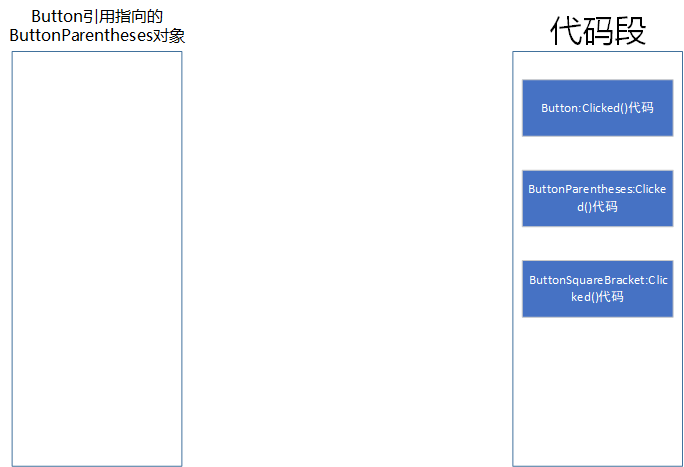
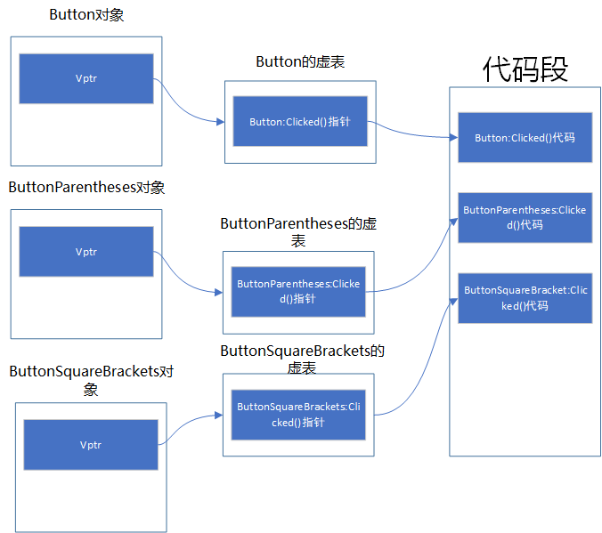
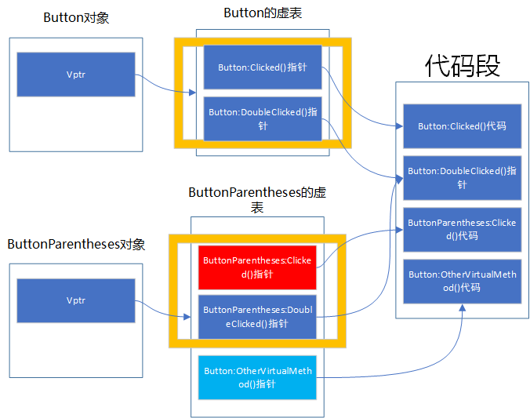
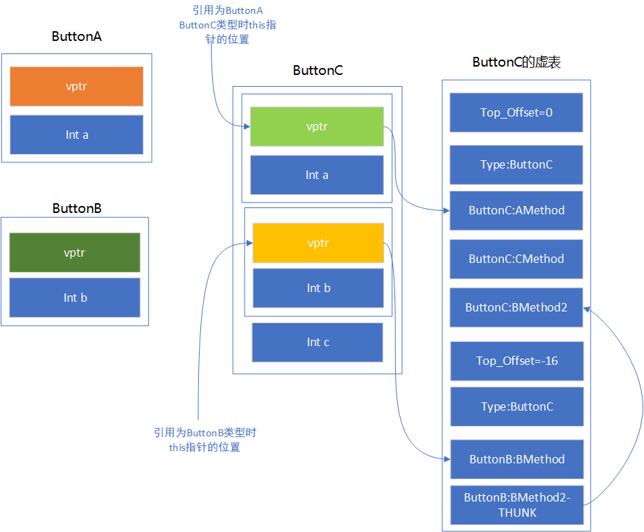
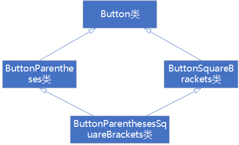
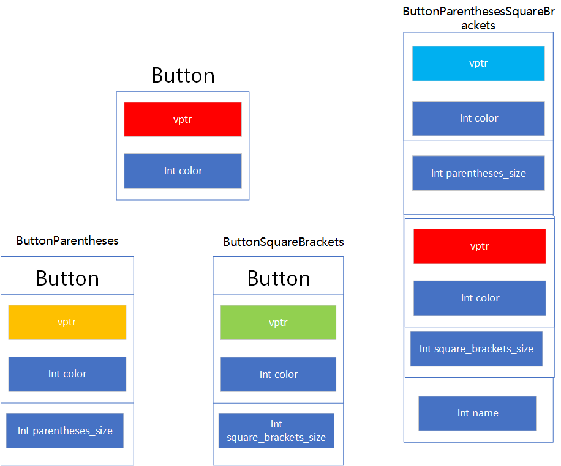
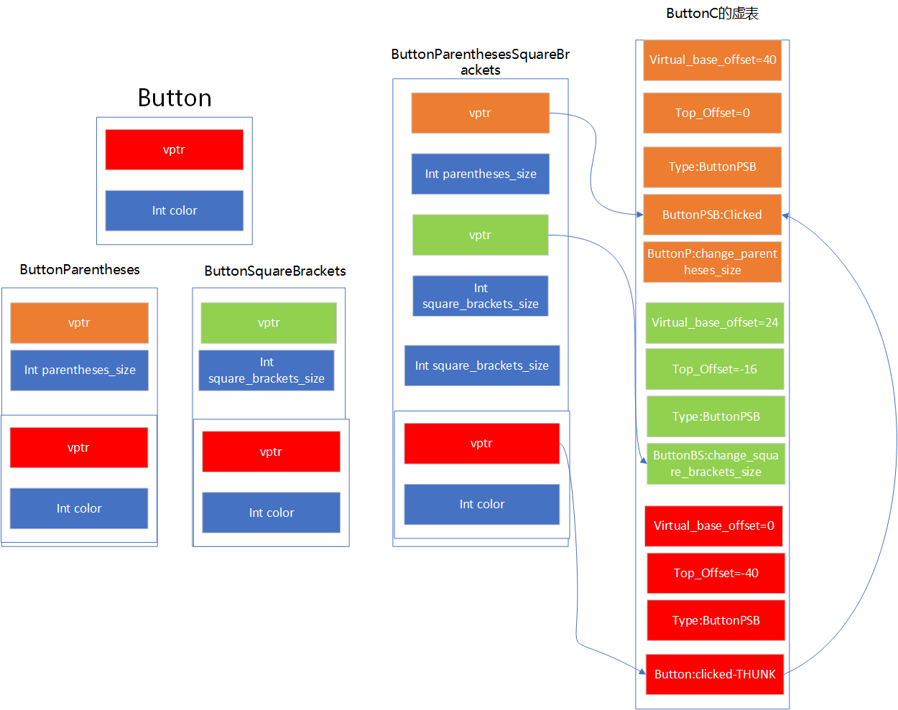

面对C++，我总会回想起那个睡觉迟到而被老师电话提醒的遥远下午……

<!--more-->

本以为自己跟这门语言将再无瓜葛，却又再次相逢。近日，好友学习C++，遇到许多底层机制，向我问起，我仅能在脑中模模糊糊得寻得*虚函数*、*虚基类表*等意义不明的词语。但答不上总觉着有些对不起那个叫我起床的老师，索性半回忆半学习，将这C++的继承机制整个明白吧！

## 概述

C++是我学习的第一门OO语言，也是机制最为繁复的OO语言，后来学习的Java、Python等都用解释器、虚拟机把机制封装起来，而C++还是老老实实地遵循C的道路，直接编译成机器码，因而其内部机制也更为透明。

C++的继承机制上，难点有二。其一是，如何实现延迟绑定，即在运行时确定调用方法，以实现子类多态；其二是，如何解决C++的菱形继承带来的语义冲突的问题。

## 延迟绑定——虚函数

要讨论C++如何用虚函数实现延迟绑定，须要先了解延迟绑定是什么，以及它在子类多态中的作用。

### 延迟绑定

何谓延迟绑定？我们知道，在C语言中，我们代码中的函数调用在编译时将被转换为汇编语言，指向函数的相对地址，并在重定位时变更为函数代码（汇编码）的绝对地址，如此，在CPU执行机器指令时才能更新pc计数器，找到函数的汇编码所在。

这样的机制，足够C语言使用了，但是在C++中，为了满足面向对象编程的**子类多态**，简单的编译时绑定地址就不够用了。

---

#### 补充：子类多态

```C++
class Button {
    void clicked(){
        cout << "Button clicked" << endl;
    }
};

class ButtonParentheses : public Button {
    void clicked(){
        cout << "(Button clicked)" << endl;
    }
};

class ButtonSquareBrackets : public Button {
    void clicked(){
        cout << "[Button clicked]" << endl;
    }
};

int main(){
    Button* b = new ButtonParentheses();
    b->clicked();
    return 0;
}

```

上述代码定义了一个按钮类，以及两个子类，其中一个是括号按钮，另一个是方括号按钮。面向OO，我们希望持有一个括号按钮，而不关心其实现，只关心按钮的行为，以此实现在不改变调用者代码的情况下，通过替换引用的指向改变行为。

---

猜猜上述代码会调用输出什么？是"Button clicked"，还是"(Button clicked)"？答案是"Button clicked"。可是我们明明指向的是ButtonParentheses类型对象啊！问题在于绑定时机。虽然Button& b = new ButtonParentheses();指定了引用的对象，但实际上，编译器由于编译器不了解从Button& b = new ButtonParentheses();开始的控制流，后续的所有对b的引用，都只能假定他是一个Button类型对象——正如其引用类型所描述的**Button**

如何破局？很简单，既然在编译时不能确定引用的对象的类型，就留待运行时再确定。这就是延迟绑定，也即动态联编。

### 虚函数

虚函数语法：

```C++
class Button{
    virtual void clicked(){
        cout << "Button clicked" << endl;
    }
};
```

如上，我们再clicked方法前加上了virtual前缀，再次执行之前的代码时，即可获得预期的结果了。那么，怎么做到的呢？有什么东西在运行时帮我们进行了调用函数的匹配吗？可惜，没有。C++被编译完后同C一样，不过一堆汇编，没什么其他进程来辅助我们的程序了，因而，所有的机制，都蕴含在C++的汇编代码中，但是，汇编过于晦涩，不妨从C++对象的内存模型入手。

#### 一般情况

在C++中，对象的内存模型是这样的：



没错，我们的小b对象中是不包含任何函数指针的，所有的调用都在编译时进行绑定，直接替换为对代码段中Button:Clicked()函数的调用。

#### 虚函数的情况

虚继承中，引入了虚表的概念，虚表是一个指针，指向一个虚函数表，虚函数表是一个数组，数组中的每一个元素都是一个指针，指向一个虚函数。这么讲可能有些凌乱，我们看图说话。



其他函数暂且不提，我们只关心虚函数Clicked的情况。如上图所示，每个对象的最开始位置存在一个Vptr，指向**虚函数表**。每个类都有自己的虚函数表，其中存放着该类所有虚函数所对应的函数在代码段的地址，换句话说——函数指针。

那么，基于该结构的函数调用呢？在虚函数机制下，编译器并非简单地将函数调用按照引用类型绑定函数的地址上，而是**调用虚表中偏移量为x的函数指针所指向的函数**。调用一个函数指针的函数，这在汇编中是可行的，因而我们可以相信编译器能够实现这件事。

那么剩下的就是确认偏移量x了，这要求我们先了解虚函数表的构造流程。

1. 父类构造自己的虚函数表，将自己的虚函数按顺序填入
2. 子类则继承（复制）父类的虚函数表，并且在子类的虚函数表中尾部添加自己的虚函数。
3. 子类对父类方法的重写，即在虚函数表中将子类的重写方法的地址替换掉对应位置的父类方法的地址。

这样，我们会得到这样一个视图。



如图，基类Button自己构建自己的虚函数表，而ButtonParentheses则继承了Button的虚函数表，即黄色框中的内容。同时，由于ButtonParentheses子类重写了Clicked方法，于是基类虚表中的第一个函数指针（红色标识）被替换成了子类的Clicked方法的地址。最后，子类将自己额外的虚函数添入虚函数表的末尾（天蓝色）。注意到：基类的方法在自己的与子类的虚表中位置相对于虚表起始位置的偏移量是固定的，哪怕是子类重写了基类的方法。

于是，我们就可以按照基类的方法便宜确定所有子类中基础虚函数方法的偏移，从而实现调用，这个固定的布局就成为了一种约定。

总结：**这个偏移处的方法指向谁不知道，但肯定是基类原本方法（未重写），或子类方法（重写）。**

### 进一步讨论

在了解虚函数、虚表概念后，我们思考一下现在持有指向子类对象的基类引用的函数调用流程。

1. 从this指针访问对象内存，获取vptr指针
2. 利用vptr指针，从对象中获取所需访问的方法的函数指针
3. 结合this指针，与函数指针，调用函数

十分自然而简单，但是在多继承环境下，以上条件并不成立。同上，我们先建立一个情景。

```C++

class ButtonA {
    int a;
    virtual void AMethod() {
        printf("a = %d\n",a);
    }
};

class ButtonB{
    int b;
    virtual void BMethod() {
        printf("b = %d\n",b);
    }
    virtual void BMethod2() {
        printf("b2 = %d\n",b);
    }
};

class ButtonC: public ButtonA, public ButtonB {
    int c;
    virtual void AMethod() {
        printf("a = %d\n",c);
    }

    virtual void B2Method() {
        printf("b = %d\n",c);
    }

    virtual void CMethod() {
        printf("c = %d\n",c);
    }
}

```

现在我们有ButtonA、ButtonB两个类，以及一个继承了ButtonA、ButtonB的ButtonC类。描绘一下ButtonC的内存结构。



这结构一下子就比之前单继承复杂多了，我们慢慢分析：

1. 引用指向对象时，可能指向对象内存中的不同部分，使用ButtonA、ButtonC指针将指向最开始，而ButtonB则指向ButtonB虚指针处。这是使得调用ButtonB的方法时，this指针加上偏移能正确访问到ButtonB的成员。
2. ButtonC类内存中仍旧含有ButtonA、ButtonB的内存结构，且在尾部补充自己的int c成员，值得注意的是，ButtonC本身仍旧没有自己的虚指针，而是与ButtonA共用，且将自己的新虚函数追加到末尾，而ButtonB则单独持有一个虚指针，他们共同指向ButtonC的虚函数表，但指向的位置不同。
3. 虚函数表中出现了Top_offset与Type两个新字段。其实单继承中也有，不过用不到，所以忽略，此处画出。Type指向ButtonC的类型信息，为C++提供了运行时类型信息。Top_offset跟虚函数表末尾的THUNK有关。

现在再分析一下调用流程：

1. 若使用ButtonA、ButtonC引用，this指向最开始处，按照ButtonA的虚指针与偏移访问虚函数；若使用ButtonB引用，this指向ButtonB的虚指针处，按照ButtonB的虚指针与偏移访问虚函数
2. 若访问虚函数，未被重写，this+函数执行正常调用；若被重写：
   1. ButtonA/C的情况，依旧按照偏移访问即可。
   2. ButtonB的情况，THUNK指向的虚函数，将this减去Top_offset，获得一个指向初始处的指针，再按照一的情况调用。这是为了防止ButtonC重写后访问了ButtonB的成员之外的字段。
   + PS:其实并没有什么判断重写，所有情况下都是this减去Top_offset，因为ButtonA/C的Top_offset都是0，所以表现得与没减一样。

## 菱形继承——虚继承

C++中除了一般的继承外，还有一种虚继承。用虚继承干什么呢？主要就是为了解决菱形继承问题。

菱形继承相比大家都很熟悉了，但还是声明一遍定义:两个子类继承同一个基类，同时两个子类又作为基类继承给同一个子类。这种继承形如菱形，故又称为菱形继承。

打个比方，假如我们继着ButtonParentheses与ButtonSquareBrackets类产生一个新的类ButtonParenthesesSquareBrackets类：



上述继承就构成了一个菱形继承。

菱形继承不挺好的嘛，有啥问题呢？这还须回到内存模型来解释。

### 非虚继承的内存模型

讨论内存模型前，我们需要丰富一下Button的场景。

```C++
class Button {
public:
    int color;

public:

    virtual void clicked() {
        cout << "Button clicked" << endl;
    }
    virtual void doubleClicked() {
        cout << "Button double clicked" << endl;
    }
};

class ButtonParentheses : virtual public Button{
public:
    int parentheses_size;

public:
    virtual void clicked() {
        cout << "(Button clicked)" << endl;
    }
    virtual void change_parentheses_size() {
        cout << "size_changed" << endl;
    }
};

class ButtonSquareBrackets : virtual public Button{
public:
    int square_brackets_size;
public:

    virtual void clicked() {
        cout << "[Button clicked]" << endl;
    }
    virtual void change_square_brackets_size() {
        cout << "size_changed" << endl;
    }
};

class ButtonParenthesesSquareBrackets : public ButtonParentheses, public ButtonSquareBrackets{
public:
    int name;
public:
    virtual void clicked() {
        cout << "([Button clicked])" << endl;
    }
};

int main() {
    Button* a = new Button();
    Button* b = new ButtonParentheses();
    Button* c = new ButtonParenthesesSquareBrackets();
    b->clicked();
    return 0;
}

```

现在，我们有一个Button类，其拥有一个按钮颜色属性，其拥有一个按钮点击方法，其拥有一个按钮双击方法。两个子类，分别为ButtonParentheses和ButtonSquareBrackets，二者都重写了基类的clicked方法，且分别有一个自己的括号/中括号尺寸属性以及对应的修改函数。最后，一个新的类ButtonParenthesesSquareBrackets，继承了ButtonParentheses和ButtonSquareBrackets，并重写了clicked方法。

这个场景下，其内存模型如何呢？先分析没有虚继承的情况下的内存模型：



注：ButtonParenthesesSquareBrackets使用的是ButtonParentheses和Button共用的虚指针，其实就是一个简单的单继承与多继承的结合。

可以看出，在非虚继承的情况下，继承就是在子类对象中保存了完整的基类对象，这就直接导致了一个严重的问题：

在ButtonParenthesesSquareBrackets中，存在着两个沿着两条路径继承下来的Button。一方面导致了内存空间的浪费，另一方面也导致指代的歧义，访问color时，到底访问的是哪一个Button的color属性呢？

### 虚继承的内存模型

虚继承是如何解决这个问题的呢？

虚函数机制引入了虚表，把直接调用变为间接调用，解决了子类多态的问题；同样，我们可以引入新的中间结构，把对基类的基类的引用转为间接，就可以引用同一个基类的基类，避免重复了。

不同的编译器有不同的解决方案：

1. 引入新的表——虚基类表
2. 拓展虚表

这里仅讨论拓展虚表的情况，引入新表思路是类似的。

```C++
class Button {
public:
    int color;

public:

    virtual void clicked() {
        cout << "Button clicked" << endl;
    }
    virtual void doubleClicked() {
        cout << "Button double clicked" << endl;
    }
};

class ButtonParentheses : virtual public Button{
public:
    int parentheses_size;

public:
    virtual void change_parentheses_size() {
        cout << "size_changed" << endl;
    }
};

class ButtonSquareBrackets : virtual public Button{
public:
    int square_brackets_size;
public:

    virtual void change_square_brackets_size() {
        cout << "size_changed" << endl;
    }
};

class ButtonParenthesesSquareBrackets : public ButtonParentheses, public ButtonSquareBrackets{
public:
    int name;
public:
    virtual void clicked() {
        cout << "([Button clicked])" << endl;
    }
};

int main() {
    Button* a = new Button();
    Button* b = new ButtonParentheses();
    Button* c = new ButtonParenthesesSquareBrackets();
    b->clicked();
    return 0;
}
```

首先，我们之前的模型中，两个子类都重写了父类的clicked方法，这种重复无法靠虚继承解决，因此我们将其删去。



现在我们得到了使用虚继承后的各个类的内存模型。

+ 对于Button，虚继承对其无影响
+ 对于ButtonParentheses，可以观测到，现在其不再复用Button的vptr，而是自己独有一个vpter，且Button的成员被置于末尾。
+ 对于ButtonParenthesesSquareBrackets，其是简单多继承与虚继承的结合，首先按照简单多继承存放ButtonParentheses、ButtonSquareBrackets、自身成员，但在最后补上了Button的成员，且其复用的还是第一个继承的ButtonParentheses的vptr。

观测虚表：

1. 虚表中多出了Virtual_base_offset字段，其余与原始类型一致。

**解释Virtual_base_offset字段**：在这样的菱形继承中，编译器将生成虚表的表，即VTT，用于记录每个类的局部虚表起始的位置。于是，现在使用ButtonParentheses类型引用调用clicked方法时，将会将this指针加上Virtual_base_offset，将this移动到Button类的vptr处，调用Button的clicked方法。但同时，由于ButtonParenthesesSquareBrackets类重写了clicked方法，因此此处的THUNK又会将this指针移动到最开始处，调用ButtonParenthesesSquareBrackets的clicked方法，由此实现了虚基类的复用。

Question：如果ButtonP与ButtonSB重写了clicked方法呢？
Answer: 仍旧使用THUNK将其引导至ButtonPSB重写处，若ButtonPSB未重写，则按照引用调用各自重写的方法，若引用为Button或ButtonPSB，则调用ButtonP的（ButtonP是第一个继承对象，与ButtonPSB共享vptr）。

至此，我们完成了对虚继承的讨论。

疑惑：在上述代码中，ButtonPSB对ButtonP与ButtonSB的继承无论是否声明为virtual，其结果都是相同的？这个问题仍然留待探索。

### 皮一下

最后，提一个问题，Java等语言是如何避免菱形继承的呢？

很简单，不允许多继承，自然就不会产生菱形继承了。

## 参考文献

1. <https://shaharmike.com/cpp/vtable-part1/>
2. <https://shaharmike.com/cpp/vtable-part2/>
3. <https://shaharmike.com/cpp/vtable-part3/>
4. <https://shaharmike.com/cpp/vtable-part4/>
5. <https://codeantenna.com/a/7RsvVrjPen>
6. <https://zhuanlan.zhihu.com/p/41309205>
