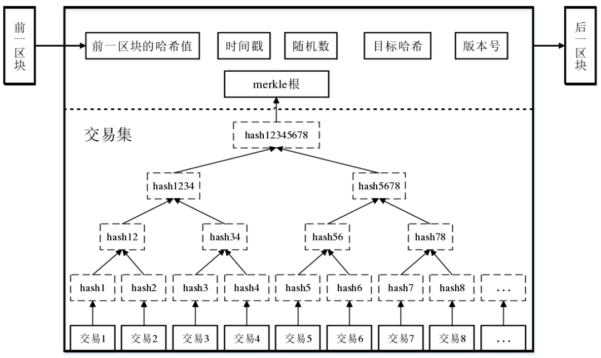

## 比特币交易机制

传统的银行机制中一般使用基于账户的模型，即系统需要在记录每一笔交易的同时计算每个账户的实时余额。在比特币的区块链场景下，我们仅记录了交易本身，这将导致我们不得不回溯历史上的所有交易来确定交易时某个账户（公钥）的余额。

幸运的是，在比特币系统中我们并不使用账户作为交易的输入。交易在区块链中使用哈希指针串联起来，每一笔交易的输出（以比特币脚本形式存在）都作为下一笔交易的输入的一部分（包含上一次交易的哈希以及公钥签名）。因而在比特币系统中实际的财产以为花费交易（UTXO）形式存在。

在需要进行交易时，用户需要提供其UTXO的哈希以及公钥签名以解锁UTXO，生成新的交易。

## 比特币脚本

比特币脚本是一种基于栈的非图灵完备语言，其包含数学计算、分支、数据逻辑处理以及密码学等指令码，但不包含循环，以避免死循环造成的攻击。

Pay to Script Hash 提供一种较为简单的创建交易的方法，付款方仅需对收款方指定的脚本哈希进行转账，该脚本在收到输入后将被反序列化并执行，从而实现对付款方透明的复杂机制。因而收款方可以在使用这笔输出时再构建当初指定的脚本码，作为输入的一部分来使用该笔输出。

PS: OP_CHECKMULTISIG 验证多重签名指令需要事先指定n个公钥，并指定参数t，当且仅当超过t个公钥提供签名时才判断为成功。

## 比特币脚本应用

1. 托管账户：使用多重签名加入第三方充当仲裁，避免某一方恶意行为；相比于传统的第三方仲裁机制，在未发生冲突时完全不需要仲裁方介入
2. 绿色地址：使用拥有公信力的绿色地址，付款方事先寄存货币，付款时由绿色地址直接转账。其公信力保证不会发生双花问题，因而可以在交易提交后直接认为交易成立。
3. 高效的微支付：在需要多次支付小额货币的情况下，将会产生高额的交易费用。因而付款方可以每次签名一笔带有多重签名的交易，将其递交给收款方，收款方先不提交交易，而是待到结算时才进行提交。这样存在两个问题：1. 收款方可以签名并提交所有付款方给与的交易，造成双花问题；2. 收款方可以不提交交易而导致付款方的交易卡顿——可以使用"退款交易"与lock_time字段来解决。

## 比特币区块

比特币的区块链结构如下所示



区块链包含两种哈希数据结构：Merkle树和哈希链。Merkle树用于验证区块中的交易，哈希链用于验证区块链的完整性。二者通过哈希链节点中的Merkle根来连接。

```Json
{
  # 区块头
  "hash":"", # 区块哈希
  "ver":2, # 版本号
  "prev_block":"", # 前一个区块哈希
  "time":0, # 时间戳
  "bits":0, # 难度
  "nonce":0, # 随机数

  # 函数体
  "mrkl_root":"", # Merkle根
  "n_tx":0, # 交易数量
  "size":0, # 区块大小
  "tx":[], # 交易列表

  # 哈希链
  "mrkl_tree":[] # Merkle树
}
```

## 比特币网络

比特币网络是一个点对点网络，节点可以自由加入退出，从一个已知的节点获得其余节点地址，从而形成任意形态的拓扑结构。

在广播交易时，收到交易的节点仅当该交易满足以下条件才进行转发：

1. 交易对于现有区块链是有效的
2. 交易的脚本类型满足白名单
3. 交易未见到过
4. 与已有的交易不冲突

其中2、3、4仅为健康检查，只要满足1即可进行广播。而4这一原则则由节点自己决定保留哪一条交易。

矿工广播新区块时的行为类似，其验证包含验证区块链头与体中每一笔交易的有效性，且**仅能转发接续在最长链后的区块**。注意到由于拓扑结构的不同与网络延迟的存在，区块的提交可能会产生竞争，即暂时的分叉，但很快新的区块将被挖掘，其决定了最长链（一般来说很少发生因为竞争产生长度超过2的分叉），而其他分叉将被丢弃。

网络中，Fully-validating nodes长期连接着，保存了整个区块链的数据，接受并转发所有节点的交易。区块链数据大部分保存在磁盘中，但UTXO的集合仍然足够小以至于能够装入内存，进行快速的交易验证;而SPV客户端则不存储整个区块链，而仅仅存储区块链头部，并请求所需的交易数据来验证交易，并信任Fully-validating nodes。

## 比特币的局限与改进

### 比特币局限

比特币设计初期并未考虑到会成为如此大规模的网络，因此其设计存在一些局限性，如：

1. 区块产生速度慢，每10分钟产生一个区块，而且区块大小有限制，因此交易吞吐量有限
2. 比特币总量有限，因此其价值受到供需的影响，而且随着时间的推移，其价值会越来越低
3. 使用固定的加密算法，随着密码学研究的推进，可能存在安全性问题

对此，存在两种改进方案：

1. 硬分叉
2. 软分叉

### 硬分叉

为了弥补比特币的不足，有时需要对比特币的客户端软件进行修改，但由于分布式的原因，难以做到全体节点一致进行升级，这就会造成网络上存在多种版本的情况。

在一种情况下，比特币协议修改过大，旧的节点将不承认新节点产生的区块，此时虽然网络互通，区块在所有节点上传递，但旧节点将忽略新类型区块，从而分叉出自己的区块链，同理，新节点则运行在新区块链上。这种使旧节点不支持新区块的修改，就是硬分叉。

### 软分叉

与之对应，软分叉则是在保持旧节点承认新区块的条件下进行升级，其表现形式往往是进一步开发比特币区块中未使用的字段。这样，即使网络同时存在新旧节点，旧节点也能接受新区块，而新节点则拒绝旧区块，长期来看，只要超过51%的节点升级为新节点，新区块形成的区块链将会成为最长链，旧区块链将会被淘汰。

但是，软分叉的行为其实是在一步步收紧区块条件，最终仍旧可能导致不得不硬分叉的情况。
