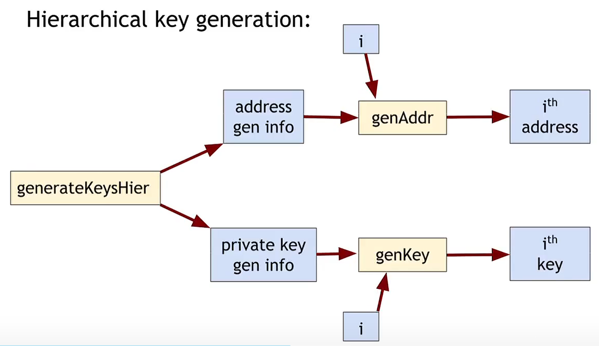
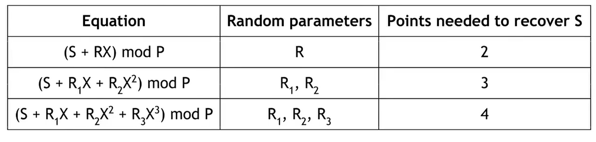

## 比特币的存储与使用

使用比特币需要用到公链信息（即USTX）以及私钥，公链信息可以自由获取，故比特币的存储与使用也就等价于私钥的存储与使用。

我们希望做到：可用性、安全性、便利性

方案：

1. 文件存储：非常便利，但是易遗失，故可用性与安全性会遭到威胁
2. 钱包软件：对每个USTX使用不同的地址，由软件统一管理

地址为二进制串，为了进行便利的传递，一般采用base58编码或QR二维码进行编码。

## 冷热钱包

冷热钱包即钱包的离线与联网，使用时一般将小部分比特币存储在热钱包里，大部分以冷钱包的形式存储在冷钱包中。

在这样的存储模式中，我们希望实现两点：

1. One USTX One address
2. 热钱包向冷钱包转账

第二点的实现较为简单，热钱包持有冷钱包公钥即可。但为了在此情况下实现One USTX One address，就需要进行更多考虑。我们可以提前建立一定量的密钥对，将公钥记录在热钱包，每次需要转账就使用一对。但这样使用较繁琐，可能需要频繁开启冷钱包，补充新的密钥对。但还存在更好的解决方案——分层钱包。

### 分层钱包

分层钱包利用了密钥对生成算法的机制，不直接生成密钥对，而是先生成用于生成公钥的信息与用于生成私钥的信息。使用这两份信息可以独立导出互相对应的公钥与密钥。

冷钱包则可以存储在物理设备、纸质文件又或者自己记住。此外，还存在某些防篡改软件，可以存储与使用，但是无法取出。

## 密钥分拆与共享

有时候我们希望能够实现多个人共同控制一个地址，我们可以从两个层面进行实现：单密钥USTX与拆分私钥；多重签名USTX与独立私钥。

### 拆分密钥

拆分密钥时，我们可以通过某些数学方法，将密钥进行处理，获取n个处理后的密钥，仅当拥有超过t(t < n)个密钥后才能进行签名。

该算法核心思路为使用不同次数的函数，利用其1-t个点确认一条直线的特性，将密钥设置为其与y轴的交点来。通过使用多阶函数，我们可以改变t，而通过取出更多的点，我们可以改变n。

### 多重签名密钥

多重签名在前面的章节进行过描述，即对USTX使用多重签名检查脚本，从而实现单个USTX需要多个签名。

## 轻钱包与交易所

### 轻钱包

除了自己搭建节点、广播交易外，我们还可以通过轻钱包来实现交易。轻钱包一般运行在浏览器上，后端连接至专门的服务提供网站，我们一般需要给予其信任。

### 交易所

交易所则是一个中心化的服务，它们可以提供交易、兑换、支付等服务。我们可以存储数字货币与法定货币，并在交易所的账户中进行自由的兑换、支付等服务。需要注意的是，当我在交易所买入比特币，区块链上的交易并没有发生，而是交易所的账户中的比特币增加了，而我的账户中的法定货币减少了。

交易所十分便利，但存在多种风险：挤兑、庞氏骗局以及黑客入侵。

为了消除顾客对前两种风险的担忧，交易所需要进行证明：

1. 自己具有足够的资金
2. 活期存款记录

对于1，交易所可以发起向自己的支付交易来证明自己的资金，然后再用发送方的密钥加密挑战串来证明是自己进行的支付。对于2，则需要交易所构建包括所有用户的默克尔树，并对每个用户提供零知识证明。

## 支付服务

支付服务为传统商户接受数字货币提供了便利，其从用户手中收取数字货币，转而向商户支付法定货币，并从中收取部分手续费。

## 交易手续费

比特币交易按照一定规则收取手续费

$$ 如果交易大小小于1000字节且输出的比特币都大于等于0.01以及具有足够高的优先级，否则每1000字节0.0001比特币$$

$$ Priority = ( \Sigma(年龄 \times 输入金额)/(交易大小) ) $$

$$ 交易大小约等于 148 \times 输入 + 34 \times 输出 + 10 $$

## 货币兑换市场

比特币兑换市场进行比特币与法定货币的兑换。

从需求角度看：

1. 比特币作为支付手段
2. 比特币作为投资手段

从供给角度看：

1. 流通货币
2. 交易所等机构产生的M2——活期存款等

当供给需求平衡，就将获取到一个稳定的汇率，在此进行比特币市场模型分析：

T = 每秒需要用比特币进行交易的总额 dollar / sec
D = 比特币用作交易媒介的周期 sec
S = 比特币总供给 Bitcoin
P = 比特币价格 Bitcoin / dollar

得到方程：

$ \frac{T}{P} = \frac{S}{D}$

$ P = \frac{DT}{S}$

因而，当流通货币减少，比特币价格将上升；当流通货币增加，比特币价格将下降。此外，比特币作为投资手段也存在其对应模型，此处不作分析。
