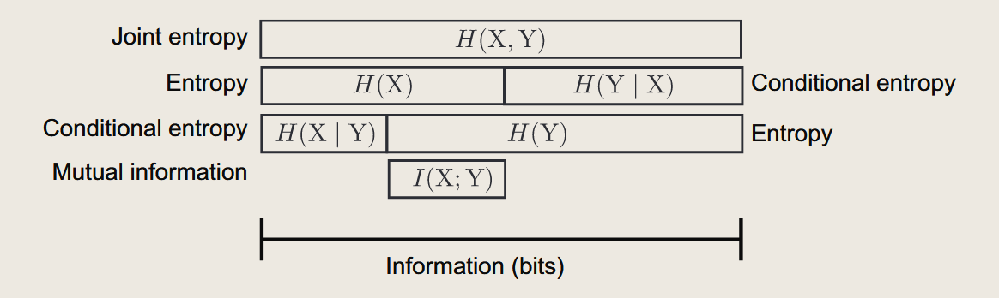

信息是一个泛泛的概念，我们了解到的有关事实的所有内容都可以被视作信息，其降低了我们对事实的不确定性。同时，信息量似乎也是可以被定性比较的，**9月11号**总是比**9月某一天**来的更有价值。但是，当我们需要将其作为一门科学来看待，研究时，就需要定量地来阐释它了。

## 信息与随机变量与熵

信息可以降低我们对事实的不确定性，所以我们的讨论基础落到随机变量上。我们有一个随机变量$X$，它的取值范围是$\{x_1,x_2,\cdots,x_n\}$，对应的概率分布是$P(X=x_i)=p_i$。我们定义$X$的信息量为：$$I(X=x_i)=-\log p_i$$
其中$log$底数为2，表征在最优编码（使用更短的编码编码更可能的情况）场景下，使用二进制编码这一情况所需要的比特数。我们可以看到，对于一个事件发生概率越大的事件，其信息量越小，这是符合直觉的。同时，我们可以看到，对于一个随机变量$X$，其信息量的期望值为：$$E[I(X)]=-\sum_{i=1}^n p_i\log p_i$$
这也正是熵的定义。我们定义随机变量$X$的熵为：$$H(X)=-\sum_{i=1}^n p_i\log p_i$$

因此，熵的含义就可以被归纳为**为了将不确定崩塌为确定的事实所需要的平均信息量（二进制bit的数量））**

## 不确定事件中的纠葛

### 条件熵

很多情况下，我们所面对的不确定之间是互相纠葛的，当其中一个不确定奔溃为确定的事实后，另一个不确定性也会随之减小。我们可以用条件熵来描述这种情况。对于X,Y两个随机变量，当确定Y的情况下，X的熵为：$$H(X|y)=\sum_{i=1}^n p_{(
x_i|y)}H(x_i|Y=y)$$
这里$p_{(x_i|y)}$表示在给定Y的情况下，X取值为$x_i$的概率。我们可以看到，条件熵描述了在给定Y的情况下，X的不确定性。我们可以将条件熵的期望值定义为：$$H(X|Y)=\sum_{i=1}^n p_{(y_i)}H(X|Y=y_i)$$
这就是**条件熵，其定义了在考虑了在确定了Y的情况下，剩下的对于X的不确定性。**

### 互信息

假若初始，对X的不确定性有$H(X)$，对Y的不确定性有$H(Y)$，当我们知道了Y的情况后，X的不确定性为$H(X|Y)$，我们可以定义互信息为：$$I(X;Y)=H(X)-H(X|Y)$$
即，当了解了Y的情况后，X的不确定性减少了多少。

互信息有以下性质：

1. $I(X;Y)=I(Y;X)$ 互信息是对称的。
2. 互信息的最小值为0，当X,Y独立时，互信息为0。这是因为在知道了Y的情况后，对X的不确定性没有减少。
3. 互信息的最大值为$min(H(X),H(Y))$，当X,Y完全相关时，互信息为$min(H(X),H(Y))$。这是因为，互信息能够减少的不确定性，一方面不能超过Y自己本来的不确定性，另一方面不能超过X本来的不确定性。（对于Y这部分，可以认为，当Y本身不具备多少不确定性时，其也无法对X的不确定性进行详细表征）

### 联合熵

在考虑到了X,Y之间的关联关系后，我们可以定义联合熵为：$$H(X,Y)=-\sum_{i=1}^n\sum_{j=1}^m p(x_i,y_j)\log p(x_i,y_j)$$
联合熵表示了(X,Y)这一联合分布的不确定性。

### 关联

从下图我们可以清晰地观察到上述几个概念之间的关联。

联合熵$H(X,Y)$是不确定的上限，$H(X)$与$H(Y)$都需要在已知对方的条件熵下进行修正，才能通过$$H(X,Y)=H(X)+H(X|Y)$$得到联合熵。而互信息则是在联合熵的基础上，减去了条件熵，得到了在已知Y的情况下，X的不确定性减少了多少。我们有$$I(X;Y)=H(X)-H(X|Y)$$，这也是互信息的定义。
综合二者，我们可以得到：$$I(X;Y)=H(X)+H(Y)-H(X,Y)$$

## 信息论与随机过程

To be continue……

## Ref

[1] H. Pinkard和L. Waller, _A visual introduction to information theory_. 2022. doi: [10.48550/arXiv.2206.07867](https://doi.org/10.48550/arXiv.2206.07867).
